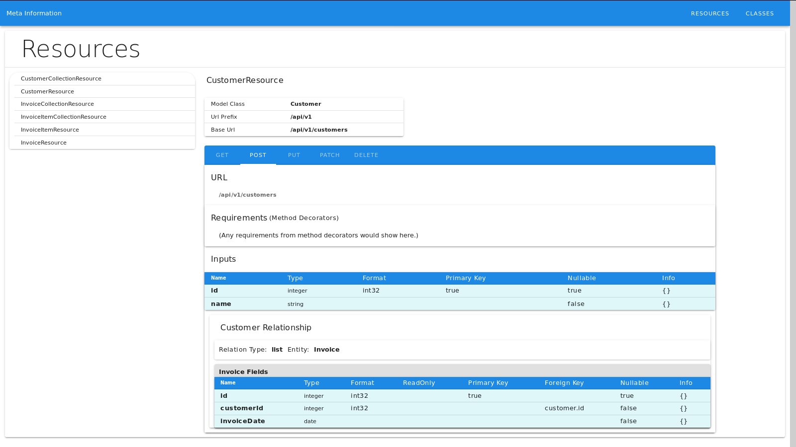

# vue-meta-info

This project provides a sample front-end for examining meta information from a Flask-RESTful-DBBase based application.

The point of Flask-RESTful-DBBase derives from introspection of Python database models created with SQLAlchemy. By using the structure of the models, the constraints and relationships, a set of tools help validate, serialize/deserialize and document a web API.

Because the output of the API is all JSON, it can be presented via a front-end application such as this.


Resource endpoints as detailed below are available. The following image is a typical class, showing the parent and a related child table.

The details of the class table follow path:

dbtable => SQLAlchemy => DBBase => Flask-RESTful-DBBase => Vue




## Project setup

Getting setup to use the sample is a two-part problem. There must be a functioning Flask server with Flask-RESTful-DBBase installed.  A sample app is found in the flask_app directory. Once that is started the Vue project can be run.

# Installation of Flask Sample API.

Use the following commands:

```
cd flask_app
python -m venv venv
source venv/bin/activate
pip install -r requirements.txt
python app.py

```

At this point, you should have the following urls at http://localhost:5000:

```

/api/v1/customers
/api/v1/customers/<int:id>
/api/v1/invoice-items
/api/v1/invoice-items/<int:id>
/api/v1/invoices
/api/v1/invoices/<int:id>
/api/v1/meta
/api/v1/meta/classes
/api/v1/meta/classes/<string:name>
/api/v1/meta/customers/collection
/api/v1/meta/customers/single
/api/v1/meta/invoice-items/single
/api/v1/meta/invoices/collection
/api/v1/meta/invoices/single

```


# Installation Vue-Meta-Info
```
npm install
```

### Compiles and hot-reloads for development
```
npm run serve
```

### Compiles and minifies for production
```
npm run build
```

### Run your unit tests
```
npm run test:unit
```

### Run your end-to-end tests
```
npm run test:e2e
```

### Lints and fixes files
```
npm run lint
```

### Customize configuration
See [Configuration Reference](https://cli.vuejs.org/config/).
